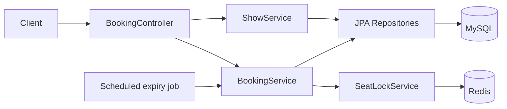

# SeatVault

A Spring Boot REST API for booking movie-theatre seats that stays correct under concurrent load: when several users race for the same seat, exactly one wins.

## Key Features

- Multi-seat booking that is all-or-nothing: either every requested seat is held or none is.
- Two-layer concurrency control: a fast Redis lock in front, MySQL row locks as the source of truth.
- Booking lifecycle: `PENDING` → `CONFIRMED`, `EXPIRED` or `CANCELLED`.
- Configurable payment-retry limit and hold timeout, with a background job that expires stale holds.
- Overlapping shows on the same screen are rejected, even under concurrent requests.
- Schema managed by Flyway migrations; Hibernate only validates it.

## Tech Stack

| Category | Technologies |
|---|---|
| Backend | Java 17, Spring Boot 3.4, Spring Web, Bean Validation, Spring Data JPA (Hibernate) |
| Database | MySQL 8.4, Flyway |
| Cache / Locking | Redis 7 (Spring Data Redis, Lua scripts) |
| Testing | JUnit 5, AssertJ, Spring Boot Test, Testcontainers |
| DevOps | Maven, Docker, Docker Compose |

## Architecture



- **Controller** only maps HTTP to DTOs; business rules live in the services.
- **SeatLockService** wraps Redis. It locks a whole group of seats atomically with a Lua script and releases only the keys the caller still owns.
- **BookingService** owns every booking state change and takes MySQL row locks before touching seat ownership.
- **ShowService** creates shows and seeds one reservation row per seat.
- **Repositories** are Spring Data interfaces; the ones that lock rows use `@Lock(PESSIMISTIC_WRITE)`.

## How It Works

What happens when two users book the same seat at the same time:

1. `POST /api/bookings` validates the seats (non-empty, no duplicates, all on the show's screen) and saves a `PENDING` booking.
2. The service asks Redis to lock every `seat-lock:{showId}:{seatId}` key in one Lua script. It succeeds only if none of the keys exist.
3. The losing user fails at this step and gets `409 Conflict`.
4. The winner then locks the matching `show_seat_reservations` rows in MySQL (`SELECT ... FOR UPDATE`, ordered by seat id so concurrent requests cannot deadlock).
5. If every row is claimable, the seats become `HELD` with an expiry time.
6. On `POST /api/payments/{id}/success`, the booking row and the reservation rows are locked again. The booking must still own a live hold; then a `confirmed_show_seats` row is written, the seats become `CONFIRMED` and the Redis lock is released.
7. If the Redis key had expired and another booking took the seat, step 6 sees the row belongs to someone else and rejects the payment with `409`. Redis can fail early, but it can never cause a double booking.
8. Payment failures beyond the limit, cancellation, and the timeout job all release the held seats.

## Database

- **MySQL 8.4**, versioned with Flyway (`V1`–`V3`).
- **Main tables:** `theatre`, `screen`, `seat`, `movie`, `shows`, `bookings`, `booking_seats`, `show_seat_reservations`, `confirmed_show_seats`.
- **`show_seat_reservations`:** one row per show and seat; it decides who owns a seat (`AVAILABLE`, `HELD`, `CONFIRMED`).
- **Unique constraints:** `(show_id, seat_id)` on both `show_seat_reservations` and `confirmed_show_seats`, so the database refuses a duplicate confirmed seat even if application logic had a bug.
- **Pessimistic locks** on the screen row (show creation), the booking row, and the reservation rows.

## API Endpoints

| Method | Endpoint | Purpose |
|---|---|---|
| POST | `/api/theatres` | Create a theatre |
| POST | `/api/theatres/{id}/screens` | Add a screen |
| POST | `/api/screens/{id}/seats` | Add a seat |
| POST | `/api/movies` | Create a movie |
| POST | `/api/shows` | Schedule a show (rejects overlaps) |
| GET | `/api/shows/{id}/seats` | Seat map with live availability |
| POST | `/api/bookings` | Hold seats for a show |
| POST | `/api/bookings/{id}/cancel` | Cancel a pending booking |
| POST | `/api/payments/{id}/success` | Confirm the booking |
| POST | `/api/payments/{id}/failure` | Record a failed payment |

Errors return `{"error": "..."}` with `404` (not found), `400` (invalid input) or `409` (conflict: seat taken, hold expired, overlapping show).

## Testing

`ConcurrentBookingIntegrationTest` uses Testcontainers to start real MySQL and Redis, boots the full app, and drives it over real HTTP. It checks that:

- 50 concurrent requests for one seat give exactly one `201` and 49 `409`s.
- 50 concurrent requests across 10 seats give exactly 10 bookings and no duplicates.
- A booking whose hold expired cannot be confirmed after another booking claims the seat.
- Cancelling and paying for the same booking at once has exactly one winner.
- Two concurrent requests for overlapping shows on one screen have exactly one winner.

```bash
mvn test        # Docker must be running
```

## Running Locally

Requires Java 17, Maven and Docker.

```bash
git clone https://github.com/Aryanrajput25/seatvault.git
cd seatvault
```

**Option 1: app on your machine, MySQL and Redis in Docker**

```bash
docker compose up -d --wait mysql redis
mvn spring-boot:run
```

**Option 2: everything in Docker**

```bash
docker compose up --build
```

The API runs at `http://localhost:8080`. Defaults are in `application.yml` and can be overridden with environment variables such as `DB_URL`, `DB_USERNAME`, `DB_PASSWORD`, `REDIS_HOST`, `LOCK_TIMEOUT_SECONDS` and `ALLOWED_PAYMENT_FAILURES`. Stop with `docker compose down -v`.

## Example

Book seat 1 for show 1:

```bash
curl -X POST localhost:8080/api/bookings \
  -H 'Content-Type: application/json' \
  -d '{"userId":"U1","showId":1,"seatIds":[1]}'
```

```json
{ "id": 1, "showId": 1, "userId": "U1", "status": "PENDING", "paymentFailures": 0, "seatIds": [1], "createdAt": "..." }
```

If a second user requests the same seat, the response is `409`:

```json
{ "error": "At least one seat is temporarily unavailable" }
```

## Future Improvements

- Authentication: `userId` currently comes from the request body.
- Idempotency keys on `POST /api/bookings`, so client retries don't create extra `PENDING` rows.
- A `GET /api/bookings/{id}` endpoint.
- Falling back to a MySQL-only check when Redis is unavailable (requests currently fail).
